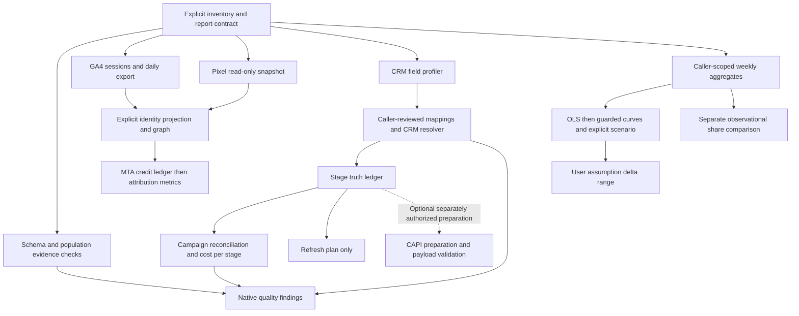

# Attribution audit

Use this skill when a user needs a structured attribution audit across the installed upstream
skills: inventory and report contract first, then taxonomy and contracts, capture and identity
where evidence allows, CRM funnel and paid attribution, MTA and MMM as separately authorized
branches, optional CAPI preparation as pure validation, and native quality tripwires last.
The audit composes or invokes upstream modules; it does not classify traffic, stitch people,
infer CRM mappings, send conversions, or replace native SQL checks.

Read [audit-contract.md](references/audit-contract.md) for artifact composition,
[execution-contract.md](references/execution-contract.md) for fresh local invocation,
[bigquery-execution-contract.md](references/bigquery-execution-contract.md) for the seventeen
fixed non-GA4 SQL routes, [python-execution-contract.md](references/python-execution-contract.md)
for MMM transports, and [entrypoints.json](references/entrypoints.json) for the exact registry.
The [shared channel contract](references/channel-contract.md) defines source boundaries across
branches. These contracts are authoritative; this page orients the workflow only.

## Declare evidence before routing

1. Freeze report scope, named IANA timezone, inclusive dates, date mode (`cohort` or `activity`),
   as-of timestamp, outcome name/kind, currencies and currency status, and opaque evidence refs.
   Cohort and activity populations are distinct. Do not infer a person bridge from a channel,
   campaign label, bare identifier, or IP address.
2. Inventory every source system and scope with `complete`, `partial`, or `unavailable` coverage.
   Supply explicit bridge declarations (`identity`, `ad_scope`, `comparability`) only when
   caller-reviewed evidence authorizes them; a bridge declaration does not run an adapter.
3. Select branches supported by supplied evidence. Missing source, table, column, permission,
   identity bridge, or history is an unavailable branch or unknown finding, not a zero or a
   fabricated fixture input. Running a synthetic example validates that example only.
4. Provide installed skill roots explicitly for every selected upstream module. The host reads
   allowlisted source bytes from those roots; it does not discover sibling directories or copy
   implementations into the audit.

## Composition-first workflow

Start with recorded artifacts when live credentials or upstream jobs are not authorized.

1. **Inventory and report contract** — boundary, inventory, bridges, evidence catalog, ordered
   steps, and retained artifacts with source/input/output hashes and runtime provenance.
2. **Taxonomy and contracts** — channel classification and shared contract copies where a branch
   needs canonical labels; preserve native labels separately.
3. **Capture and identity** — pixel read-only snapshot and identity projection when PostgreSQL
   evidence and explicit identity roots exist; clickstream dedupe, graph, and webhook resolution
   when qualified touches and bindings are supplied.
4. **CRM, funnel, MTA, MMM, CAPI** — invoke only branches with explicit inputs: CRM profiler and
   resolver, stage truth and cost per stage, MTA credit ledger and metrics, weekly MMM and framing,
   and optional CAPI conversion preparation or payload builders as pure validation.
5. **Quality tripwires** — attach actual native findings from the nine checks or metadata/population
   extractors when authorized BigQuery evidence exists.
6. **Reconcile unknowns** — preserve unavailable and failed execution separately from native
   `pass`, `fail`, and `unknown` quality statuses; never substitute runtime errors for native
   findings or fabricate missing checks.

Run artifact composition with [`compose-audit.mjs`](scripts/compose-audit.mjs):

~~~js
import { composeAudit } from './scripts/compose-audit.mjs';

const result = await composeAudit(recordedInput, {
  skillRoots: {
    'channel-taxonomy': '/path/to/installed/channel-taxonomy',
    'attribution-data-quality-tripwires': '/path/to/installed/attribution-data-quality-tripwires'
  }
});
~~~

Fresh local invocation uses [`execute-audit.mjs`](scripts/execute-audit.mjs) when authorized to
call actual installed JavaScript modules, Python MMM scripts, and mocked BigQuery transport:

~~~js
import { executeAudit } from './scripts/execute-audit.mjs';

const result = await executeAudit(freshInput, {
  skillRoots: explicitInstalledRoots,
  pythonExecutable: '/path/to/venv/bin/python',
  bigquery: {
    configuration: {
      billingProject: 'your-billing-project',
      location: 'US',
      maximumBytesBilled: '1073741824'
    },
    reportDirectory: '/path/to/private/audit-reports'
  }
});
~~~

Return the complete composition or inner `composition` envelope unchanged. An interpretation may
accompany native outputs, but must not replace unknowns, discard caveats, rewrite statuses, or
fabricate missing fields.

## One-way call graph

Upstream skills form a directed acyclic graph. The audit may call an upstream module only through
its registered entrypoint; upstream skills never call the audit or each other through this host.
Channel taxonomy is a shared dependency for classification branches, not identity evidence.

The GA4-to-identity arrow requires an explicit adapter and verified identity evidence; it is not
a shipped automatic GA4 person bridge. The profiler-to-resolver arrow is a reviewed configuration
handoff: profiling verdicts do not automatically become accepted mappings. Optional CAPI branches
prepare and validate payloads only; provider send, outbox mutation, and network delivery are
separate workflows, not automatic audit actions.

| Skill | Registry entry | Audit handoff |
| --- | --- | --- |
| channel-taxonomy | `classify` | Canonical channel, rule, basis via `classify` |
| ga4-bigquery-export | `sessions`, `channel_daily` | Native scoped SQL rows; not interchangeable with pixel |
| first-party-pixel | `identity_projection`, `identity_snapshot`, `native_views` | Snapshot exports and graph projection with explicit identity root |
| clickstream-identity-stitching | `dedupe_touches`, `identity_graph`, `webhook_resolution` | Deduped touches, graph diagnostics, webhook receipt |
| crm-attribution-profiler | `profile` | Verdicts and diagnostics; not authorization to map |
| crm-paid-attribution | `attribute_leads`, `attribute_leads_sql` | All lead rows with match evidence retained |
| funnel-truth-and-cost-per-stage | `stage_truth`, `cost_per_stage`, `refresh_partitions` | Stage ledger, cost report, refresh plan only |
| multi-touch-models-sql | `credit_ledger`, `attribution_metrics` | Ledger, coverage, allocation metrics |
| mmm-and-incrementality-framing | `weekly_mlr`, `response_curves`, `framing` | Guarded numerical outputs; no causal lift |
| capi-match-keys | `conversion_preparation`, `provider_payloads` | Eligibility, preparation, exact payloads |
| attribution-data-quality-tripwires | nine checks plus extractors | Full native finding envelope per check |

## Execution status and quality are separate

Each step exposes `execution_status` (`succeeded`, `unavailable`, `failed`, `not_requested`),
reason codes, input/output evidence refs, and unchanged native bytes. A succeeded execution is
not a native pass: keep native fitted, unavailable, ambiguous, unknown, and fail statuses intact.
Missing required evidence is unavailable; contradictory inputs or runtime errors are failed
execution. Do not fabricate native findings for either.

Aggregate execution status is `complete` only when every requested required step executed
successfully with sufficient evidence, `partial` for unavailable required evidence, and
`execution_failed` if any required step failed. Quality status reduces actual native findings
only (`fail` before `unknown` before `pass`); absence of a required finding is unknown coverage.
A completely executed audit may still report real quality failures.

## Adapter and proof boundaries

**Offline BigQuery host and composer** — artifact composition, fresh JavaScript invocation,
mocked BigQuery transport, SQL rendering, and Python MMM transports are verified offline against
recorded fixtures and independent literal goldens. These checks establish host integrity relative
to supplied bytes; they do not claim fresh warehouse SQL ran on customer data.

**GA4 SQL and PostgreSQL adapters** — `ga4-bigquery-export` sessions/daily SQL,
`first-party-pixel` identity snapshot, and native PostgreSQL views report
`adapter_not_implemented` through the fresh host. Never treat these surfaces as implemented audit
branches without a separately reviewed adapter. A missing GA4 dependency is unavailable, not
pixel substitution.

**Native BigQuery proof** — prepare-only provisioning plans exist for separately authorized
native integration (`test-execute-audit-bigquery-native.mjs` with explicit flags). Live `--run`
against authenticated `bq` is not part of ordinary audit invocation or the default offline suite.
Do not claim native job completion from composition or mocked transport evidence alone.

Model evaluation for this skill is documented in [eval.md](references/eval.md). Deterministic
fixtures, scorer self-tests, and recorded model matrices are separate evidence. Do not treat
harness validation or another skill's matrix as proof this audit ran on production data.

## Verify offline

From this skill root:

~~~sh
node scripts/test-compose-audit.mjs
node scripts/test-execute-audit.mjs
node scripts/test-execute-audit-bigquery.mjs
node scripts/test-execute-audit-python.mjs
node scripts/test-audit-bigquery-transport.mjs
node scripts/test-render-audit-sql.mjs
~~~

These default commands validate contracts and report **NO SQL EXECUTED** or **MOCKED, NO SQL
EXECUTED** where applicable. Native BigQuery integration with authenticated `bq` requires
explicit `--prepare-only` or `--run` flags on the native test runner and is separately authorized.
PostgreSQL snapshot reads require an actual database adapter and are not invoked by the offline
host suite.

Use Node 22+ when invoking the full installed dependency set, consistent with the CAPI contract.
Install MMM's own `requirements.txt` in an explicit Python environment when running MMM branches.
Keep every selected upstream skill at its independently installed root with matching source hashes.
